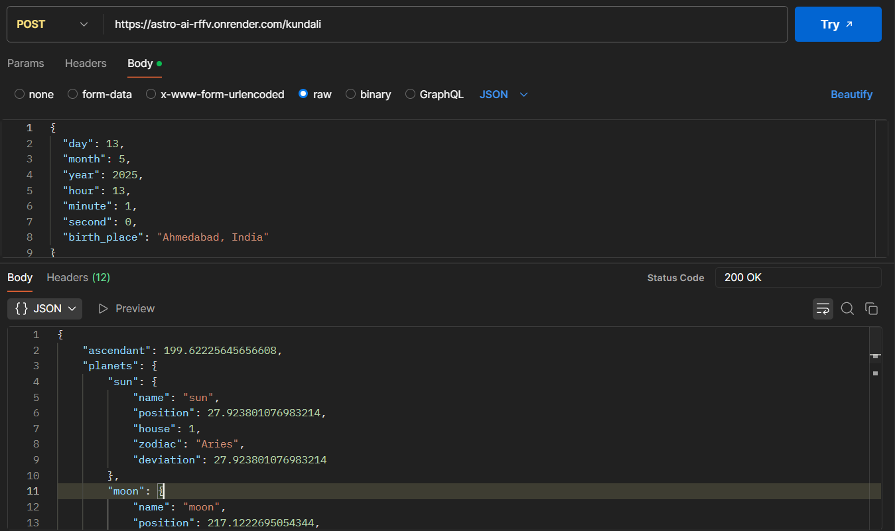
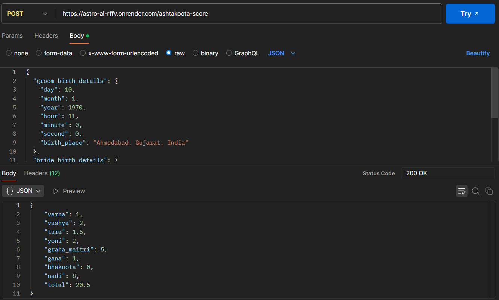
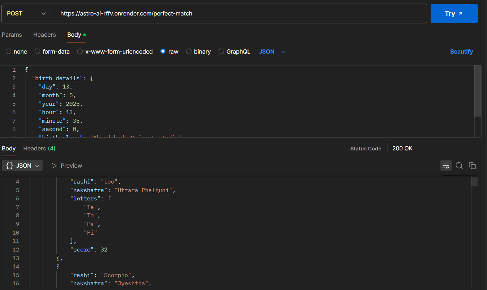
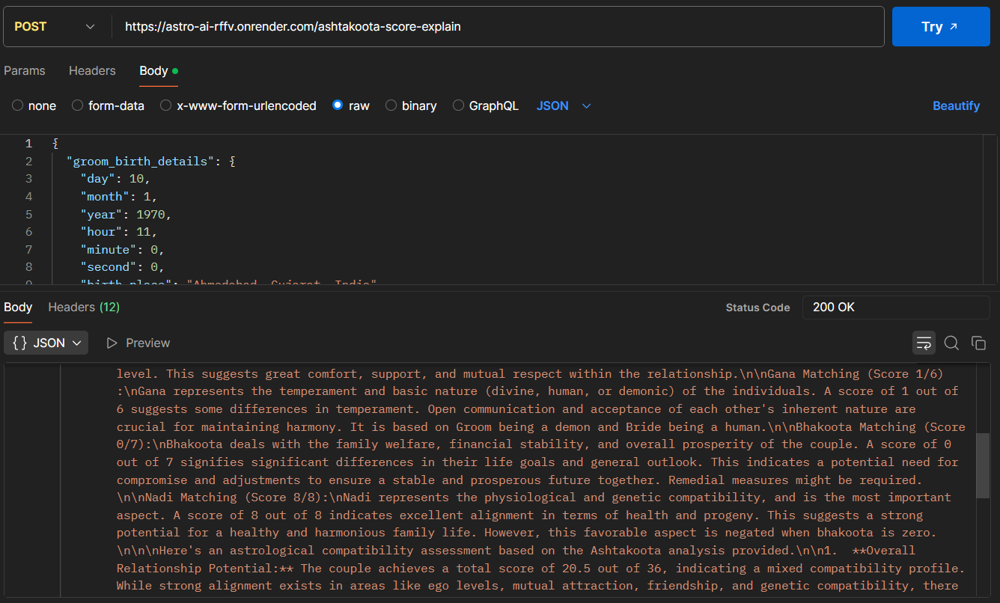

# Astro-AI

## Overview

Astro-AI aims at simplifying Indian astrology-based matchmaking and charting, using traditional calculations enhanced with LLM-based natural language explanations for better accessibility.
It's a FastAPI-based REST API framework which exposes APIs to generate readings and their explanation.

## API Endpoints

1. `/kundali`: Generates a detailed Kundali (natal chart), including planetary positions and house placements, based on date, time, and place of birth.

2. `/ashtakoota-score`: Computes the Ashtakoota score for two individuals, covering all 8 compatibility dimensions used in Vedic matchmaking.

3. `/my-perfect-match`: Returns top compatible Rashi-Nakshatra-NameLetters with score > 22 (which is deemed compatible as per Vedic astrology) for an individual, based on traditional Indian matchmaking principles.

4. `/ashtakoota-score-explain` (LLM-enhaced): Uses LLM Agents to provide a natural language explanation of the Ashtakoota score — breaking down how each dimension contributes and what it means for a relationship. This is the core feature aimed at demystifying traditional astrology.

## It's Live! Try it yourself

Swagger UI link: https://astro-ai-rffv.onrender.com/docs

Note: Since the project is hosted on Render, it scales down during inactivity. So, the first request might take around 1-2 minutes to come back.

## Sample Results

1. `/kundali`


2. `/ashtakoota-score`


3. `/my-perfect-match`


4. `/ashtakoota-score-explain`


## Installing and Running Locally

Run the following commands in your terminal to setu things up. By default the backend will be running at: http://127.0.0.1:8000

Also, this application was compiled with Python v3.11.9. So any version equal or above it will be fine.
```
git clone https://github.com/hem210/astro-ai.git
cd astro-ai
python -m venv venv
source venv/bin/activate
pip install -r requirements.txt
uvicorn app.main:app --reload
```

## Features & Capabilities

- **Vedic Astrology Calculations**: Uses the Swiss Ephemeris (with Lahiri sidereal system) for accurate planetary and house computations aligned with traditional Indian astrology.

- **Kundali Generation**: Computes detailed natal charts, including ascendants and planetary positions across houses.

- **Matchmaking Logic**: Implements classical Ashtakoota matching with an 8-dimension scoring system for compatibility.

- **LLM-Based Explanation**: Core feature that uses a language model to explain the Ashtakoota score in plain language, making astrological insights accessible to non-experts.

- **Personalized Match Suggestions**: Recommends compatible Rashi-Nakshatra pairs along with the Name letters for individuals based on traditional compatibility rules. This helps in easy identification of people based on names for compatibility (assuming people are named based on the appropriate letters of Rashi/Nakshatra).

## Future Improvements

- **Fix for Lagna (Ascendant) Calculation**: The current method for calculating the ascendant has some imprecision, which can affect the accuracy of house placements in the Kundali. Refining this logic will improve the accuracy of results.

- **Daily Personalized Suggestions**: Plan to add a feature that provides daily insights based on the user's current Mahadasha and Antardasha, helping users make day-to-day decisions guided by Vedic astrology.
